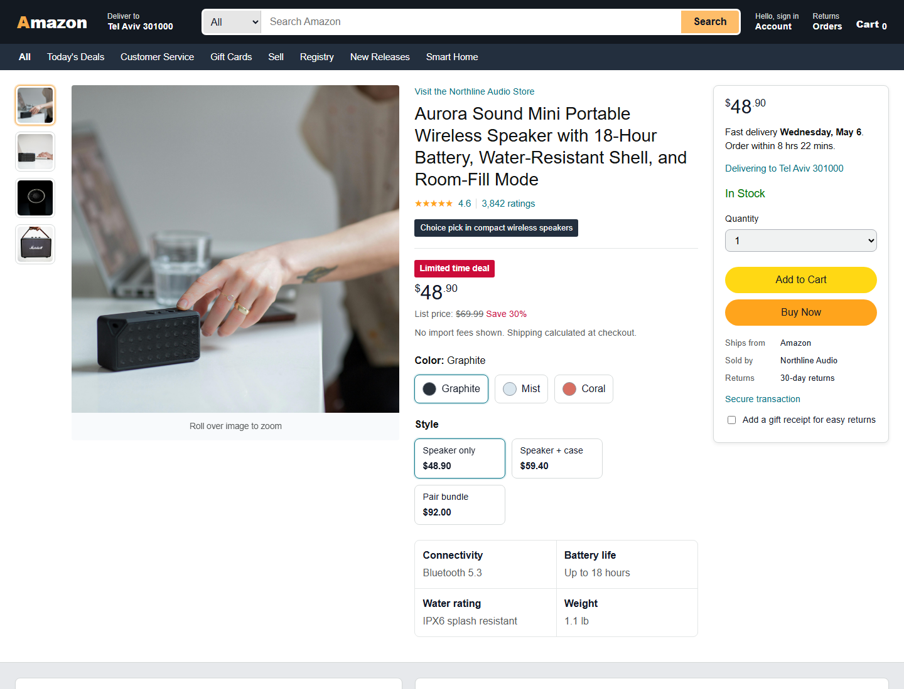

# Amazon-Style Product Page

A polished, responsive e-commerce product page inspired by the layout of a modern Amazon product listing. The project is built with **HTML5** and **CSS3 only**, using original demo content, local product images, and a static deployment on Netlify.

## Live Demo

[View the live project on Netlify](https://amazonshopdemo3.netlify.app/?category=All&q=#)

## Screenshot



## Overview

This project recreates the structure and feel of a full product detail page, including a navigation header, search bar, product gallery, purchase panel, product details, related product cards, and footer. It is designed as a front-end practice project and portfolio piece.

## Features

- Responsive desktop, tablet, and mobile layout
- Dark e-commerce header with brand, search, account, orders, and cart areas
- Secondary navigation bar
- Product image gallery with thumbnail column
- Product title, rating, reviews, discount, price, and option selectors
- Purchase card with delivery details, quantity selector, Add to Cart, and Buy Now buttons
- Product information table
- About section with product highlights
- Product description section
- Related product card grid
- Multi-column footer
- CSS-only hover effects
- Accessible HTML structure with semantic elements and image alt text

## Tech Stack

- HTML5
- CSS3
- CSS Grid
- Flexbox
- Netlify

No JavaScript, frameworks, or external CSS libraries are used.

## Project Structure

```text
Amazon/
├── assets/
│   ├── screenshots/
│   │   └── homepage.png
│   ├── earbuds-speaker.jpg
│   ├── portable-speaker.jpg
│   ├── speaker-desk.jpg
│   ├── speaker-main.jpg
│   └── speaker-top.jpg
├── index.html
├── styles.css
├── netlify.toml
├── .gitignore
└── README.md
```

## Run Locally

Clone the repository and open `index.html` in your browser.

```bash
git clone https://github.com/yosef132/Amazon.git
cd Amazon
```

No installation or build step is required.

## Netlify Deployment

The project includes a `netlify.toml` file for static hosting.

Recommended settings:

- Build command: leave empty
- Publish directory: `.`
- Production branch: `main`

## Disclaimer

This is an educational front-end demo project. It is not affiliated with, endorsed by, or connected to Amazon. Product names, content, and page details are original demo material.
